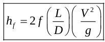
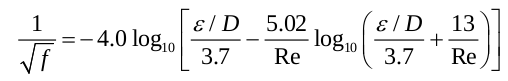
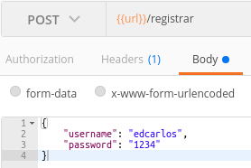
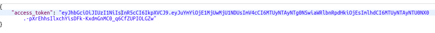
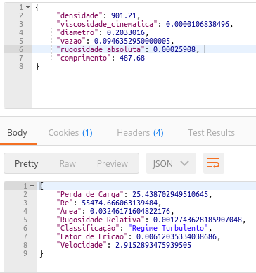

# API Head Loss

This API will allow calculations of head loss on a pipe.

- Head Loss

- Friction Factor (Zigrang-Sylvester Equation)

**At this stage, the system is calculating the linear head loss on the pipe and making the access control of users using 'username' and 'password'**

- To create a system user you must pass via POST [JSON] the following parameters for 'host/register': **Username | Password**

- For you to authenticate to the system you must pass via POST [JSON] the following parameters for 'host/auth' (an 'acess_token' will be generated, which will be required for access to the head loss calculations): **Username | Password**

- To perform the calculations, you must pass via POST [JSON] the following parameters for 'host/headloss' (**All units in SI**): **Fluid Density | Fluid Kinematic Viscosity | Pipe Diameter | Fluid Volumetric Flow | Average Roughness of the Interior Surface of the Pipe | Pipe Length**

Technology: (Python(https://www.python.org/) Flask(https://flask.palletsprojects.com/), Flask Restful(https://flask-restful.readthedocs.io/), Flask-JWT(https://pythonhosted.org/Flask-JWT/)).

Applied Knowledge: Chemical Engineering | Fluid Mechanics

